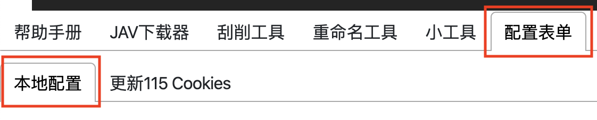
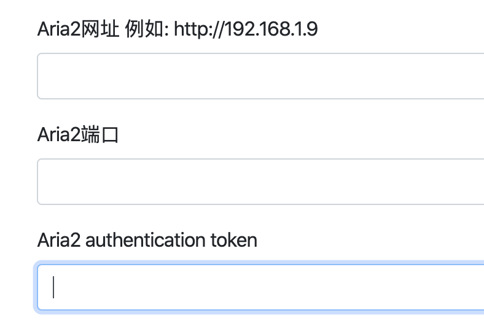
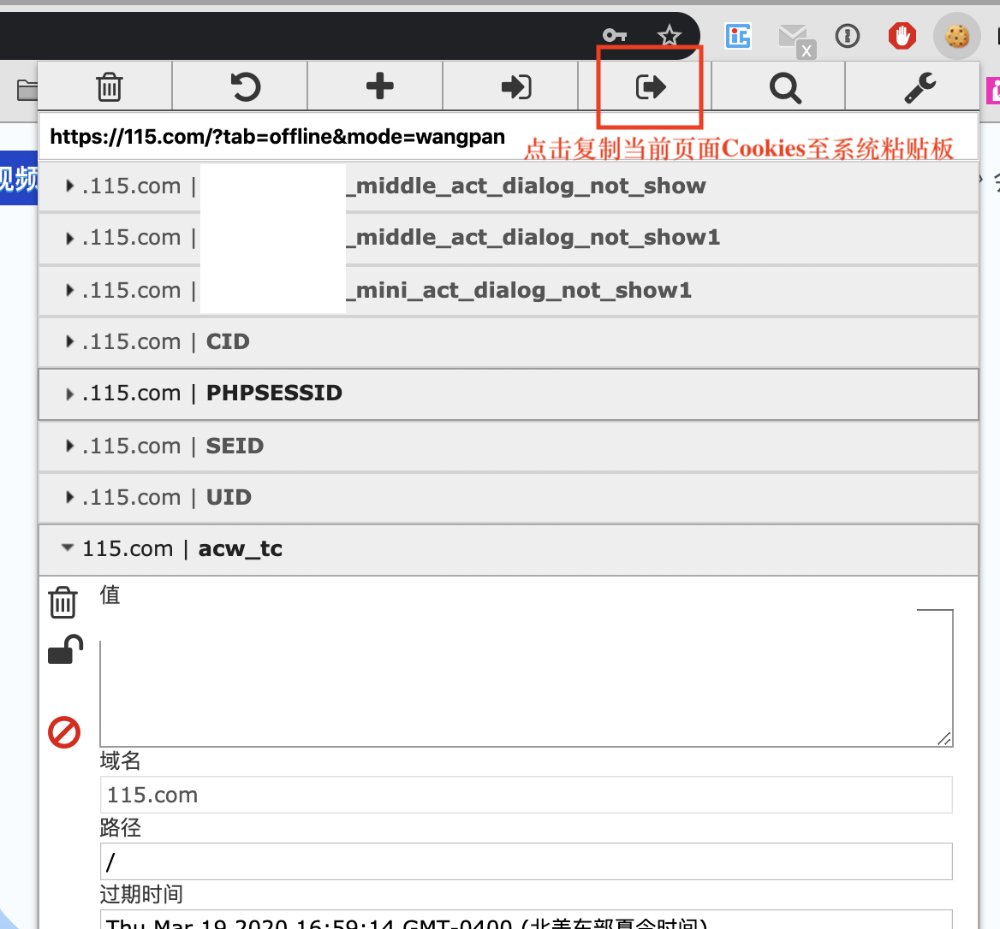
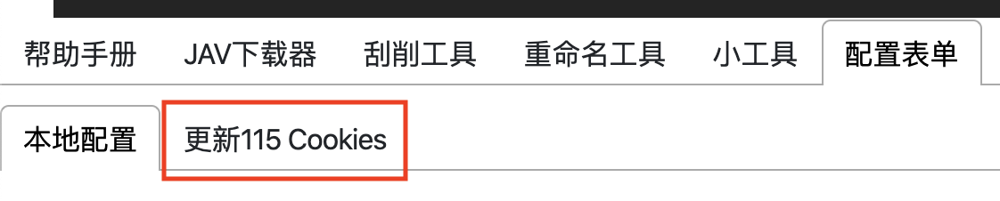
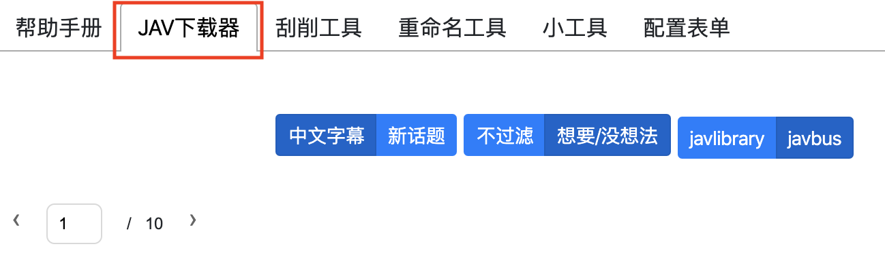
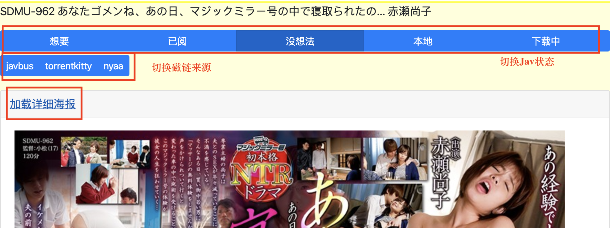
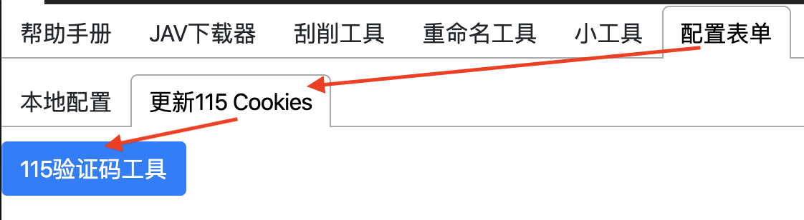

# JAV Downloader JAV 下载器 上手教程
**千里之行, 始于架构**

JAV下载器集成Jav网站-115-Aria2下载于一个界面, 需要正确的115_cookies.json和Aria2

(目前可以设置HTTP代理但是代码并没有测试过)

## 设置115 cookies和aria2
### 配置aria2服务器
先切换至"配置表单"并选取"本地配置"(默认)

为了能自动添加下载链接至aria2服务器, 填入下列3个域并点击"提交"按钮保存设置:
* aria2网址: 请参照例子填入, 必须含有"http://"前缀, 不需要结尾的"/"
* aria2端口: aria2服务器的端口号
* aria2 authentication token: 目前只支持token的验证方法(不支持用户名密码验证), 在此域填入aria2服务器设置的验证token

### 设置115 cookies

为了能自动添加磁链至115离线下载, 进行以下步骤:
* 获取115 cookies:
    * 登录115网页版
    * 使用EditThisCookie Chrome插件复制cookies至系统粘贴板
    
* 填入115 cookies:
    * 进入工具网页, 切换至"配置表单"之下的"更新115 Cookies"
    
    * 粘贴(Ctrl+V)系统粘贴板内的115 Cookies, 工具将自动保存填入的内容. (自动在目录创建115_cookies.json, 用户也可以手动更改)
    
    * 如需更新115 Cookies, 用户亦可以通过相同的操作用"配置表单"更新.

## 下载Jav

### Jav本地数据库状态列表
JAVOneStop有本地文档储存的数据库, 用以储存Jav相关信息. 对于Jav下载器来说, 最关联的域为"stat", 用于用户识别不同Jav的状态. 数据库假设车牌有唯一性, 一个车牌只能对应一个Jav.
<!-- https://www.tablesgenerator.com/markdown_tables -->
| 数据库stat值 | 显示 | 备注 |
|--------------|--------|-----------------------------------------|
| 0 | 想要 | 想下载, 在此状态会加载磁链 |
| 1 | 已阅 | 不感兴趣, 主要用于过滤 |
| 2 | 没想法 | 默认选项, 不会被过滤 |
| 3 | 本地 | Jav已存在于本地, 会被过滤 |
| 4 | 下载中 | 已通过工具添加至aria2下载,  会被过滤 |

### 下载Jav教程:
* 选择"JAV下载器"

    * 下载器默认选择"javbus"作为网站来源; "中文字幕"页面; 并过滤所有非"想要"或者"没想法"的状态
    * 如果115或者aria2没有配置, 工具页面将有提示
* 将想要下载的Jav切换至"想要"状态, 工具将加载磁链并显示下载按钮
* 选择想要下载的磁链, 并等待下载添加完成

### 备注
* 如果磁链下载成功添加至aria2, 对应Jav将自动转换至"下载中"状态
* 主页面默认只显示缩略图(图片尺寸小, 加载迅速和防止被限流); 如需加载全海报, 则可以点击"加载详细海报"按钮, 工具将会加载大图海报
* 用户可以同时下载同一页面多个Jav的磁链, 但不推荐同时下载多个单一Jav里的磁链(第一个磁链添加成功则会切换Jav状态, 用户看不到其他磁链下载结果)
* 用户可以自行切换Jav状态, 切换结果将自动存入数据库
* 工具默认采用"javbus"作为磁链搜索源(最全最快), 用户可以自行切换磁链搜索源, 目前提供"torrrentkitty"和"nyaa"里站.

## 瀑布流浏览
主页面支持瀑布流浏览并自动加载多余内容.

备注: 如果一个页面内容过少可能无法触发自动加载, 请手动增加页数以加载更多内容.

## 过滤功能, 来源切换

### 过滤器
本工具默认会开启"想要/没想法"过滤器, 此过滤器将过滤获取的Jav, 并只显示"想要"和"没想法"状态的Jav. 用户可以自行切换成"不过滤"以显示所有Jav.

### 来源切换
本工具目前支持2个来源网站: javbus和javlibrary. 用户可以自行选择切换不同的来源网站. 每个来源网站有不同的来源页面, 具体来源页面参照下表:
| 来源网站 | 标签 | 来源页面 |
|----------------------------|----------|------------------------------------------------|
| javbus | 中文字幕 | https://www.javbus.com/genre/sub |
| javbus | 新话题 | https://www.javbus.com/ |
| javlibrary | 最想要 | http://www.javlibrary.com/cn/vl_mostwanted.php |
| javlibrary | 高评价 | http://www.javlibrary.com/cn/vl_bestrated.php |
| javlibrary | 新话题 | http://www.javlibrary.com/cn/vl_update.php |
| javlibrary (未来将更改) | 还未下载 | 数据来源于数据库中状态为"想要"的Jav |

## 手动搜索
本工具亦带有搜索来源网站功能, 可以通过改变"搜索类别"下拉菜单自由切换:
* 番号
    * 将想搜索的番号填入"搜索字符"栏并点击"提交"按钮.
    * 由于结果将写入数据库, 请使用标准番号, 如IPZ-773
    * 字母须大写; 必须带"-";
* 女优
    * 这里的"搜索字符"需要填入来源网站的女优id
    * javbus: "三上悠亜" => "okq" (不含引号)
        * https://www.javbus.com/star/okq 女优id为"star"之后的字母
    * javlibrary: "三上悠亜" => "ayera"
        * http://www.javlibrary.com/cn/vl_star.php?s=ayera 女优id为"s="之后的字母
* 分类
    * 类似于女优搜索, 这里需要填入的"搜索字符"为分类的id
    * javbus: "温泉" => "6j"
        * https://www.javbus.com/genre/6j
    * javlibrary: "韩国" => "a4hq"
        * http://www.javlibrary.com/cn/vl_genre.php?g=a4hq

手动搜索结果亦支持瀑布流浏览.

## 手动验证115

当用户大量添加磁链至115离线工具后, 会触发115验证工具. 用户可以选择前往115离线工具页面, 手动添加磁链并验证. 或者, 亦可使用本工具自带的115验证工具进行快速验证.

由于iframe无法传递cookies, 要求打开本工具的浏览器必须同时登录进115离线工具. 以下情况无法使用自带的115验证工具: Chrome登录进115离线网页, 但是使用Firefox打开本工具.

### 115验证工具使用教程:

* 进入"配置表单", "更新115 Cookies"工具, 并点击"115验证码工具"按钮.
* 在弹出的窗口中通过115验证.
    * 验证成功目前不会有任何提示, 用户等待几秒之后就可以退出并继续添加磁链
    * 验证失败则弹出窗口内会提示用户重新验证
    * 如果弹出窗口显示不了正确的文字, 则用户当前使用的浏览器没有登录115, 请在当前使用的浏览器登入115离线(更新Cookies)并重新尝试

电报反馈: [link](https://t.me/joinchat/PBVbLRfEaXOVFifI2nz3Kg)
